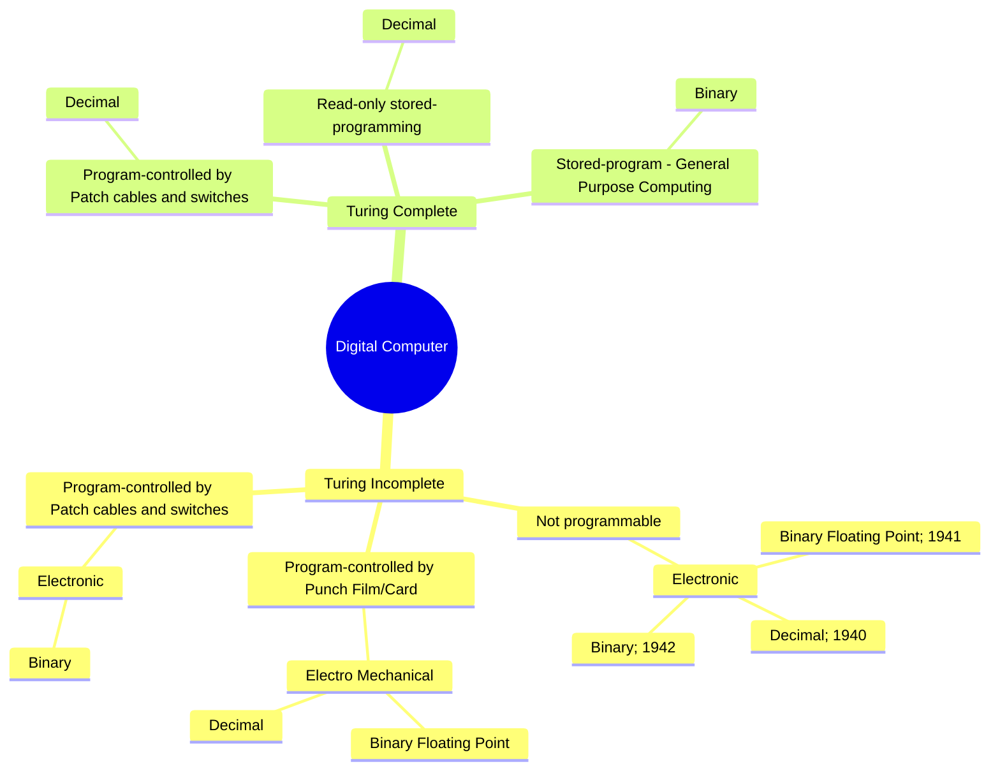
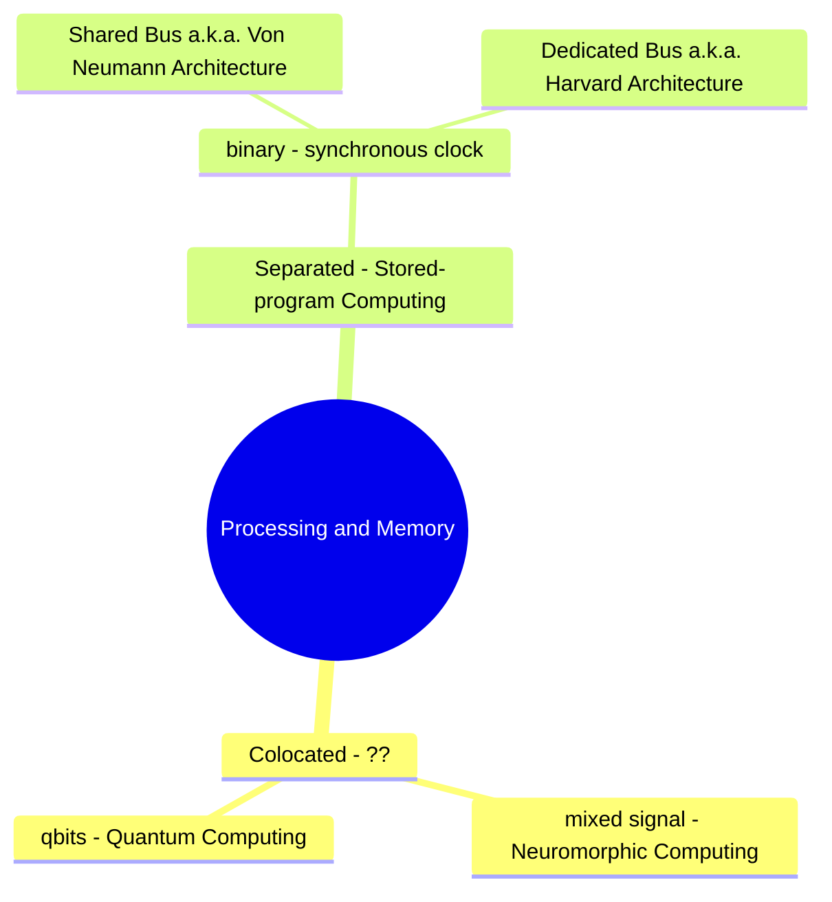
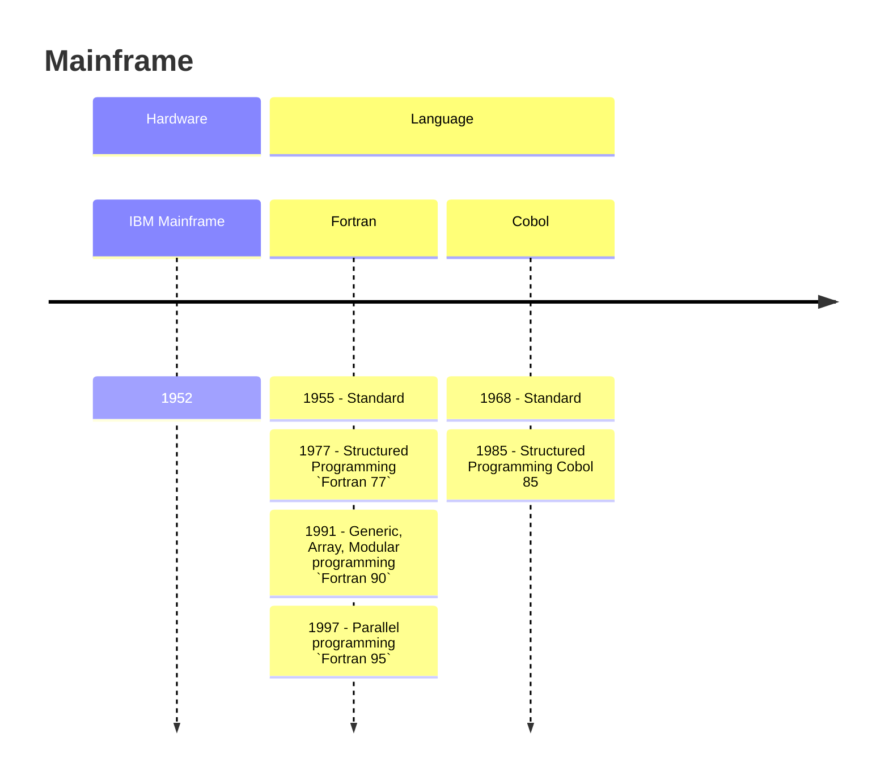
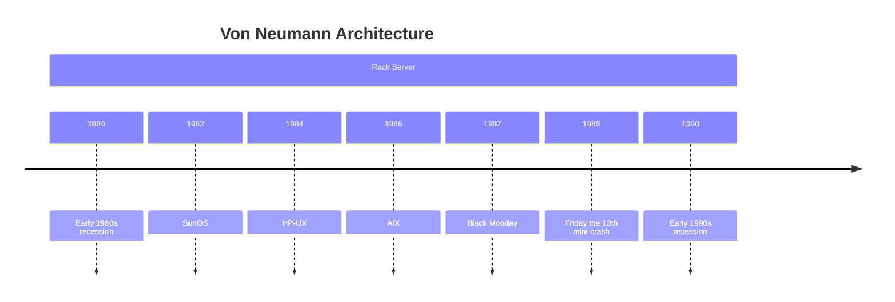
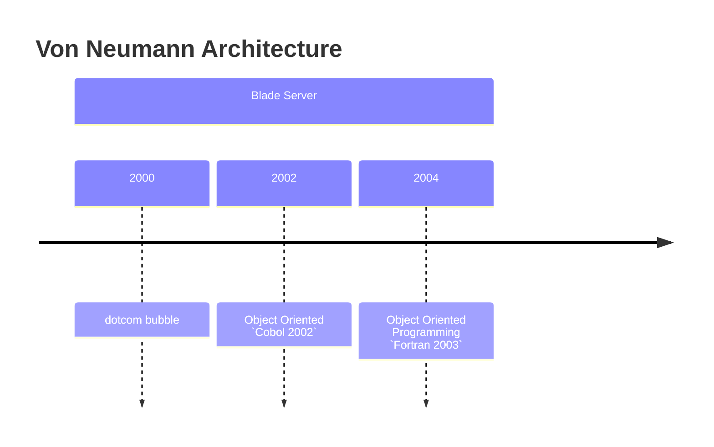
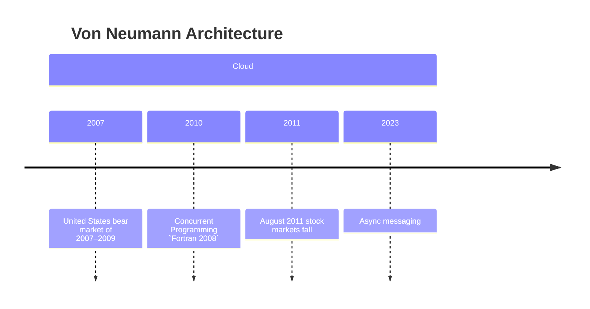

# Compute Chronology

## Compute Categories

```mermaid
mindmap
  root((Digital Computer))
    Turing Incomplete
        Not programmable
            Electronic
                Decimal; 1940
                Binary; 1942
                Binary Floating Point; 1941
        Program-controlled by Punch Film/Card
            Electro Mechanical
                Binary Floating Point
                Decimal
        Program-controlled by Patch cables and switches
            Electronic
                Binary
    Turing Complete
        Program-controlled by Patch cables and switches
            Decimal
        Read-only stored-programming
            Decimal
        Stored-program - General Purpose Computing
            Binary
```

```mermaid
mindmap
  root((Processing and Memory))
    Colocated - ??
        mixed signal - Neuromorphic Computing
        qbits - Quantum Computing
    Separated - Stored-program Computing
        binary - synchronous clock
            Shared Bus a.k.a. Von Neumann Architecture
            Dedicated Bus a.k.a. Harvard Architecture
```

## Programming Language

```mermaid
timeline
title Mainframe
section Hardware
  IBM Mainframe: 1952
section Language
  Fortran: 1955 - Standard
         : 1977 - Structured Programming `Fortran 77`
         : 1991 - Generic, Array, Modular programming `Fortran 90`
         : 1997 - Parallel programming `Fortran 95`
  Cobol: 1968 - Standard
       : 1985 - Structured Programming Cobol 85
```

```mermaid
timeline
    title Von Neumann Architecture
        section Rack Server
          1980: Early 1980s recession
          1982: SunOS
          1984: HP-UX
          1986: AIX
          1987: Black Monday
          1989: Friday the 13th mini-crash
          1990: Early 1990s recession
```

```mermaid
timeline
title Von Neumann Architecture
section Blade Server
  2000: dotcom bubble
  2002: Object Oriented `Cobol 2002`
  2004: Object Oriented Programming `Fortran 2003`
```

```mermaid
timeline
title Von Neumann Architecture
section Cloud
  2007: United States bear market of 2007–2009
  2010: Concurrent Programming `Fortran 2008`
  2011: August 2011 stock markets fall
  2023: Async messaging
```